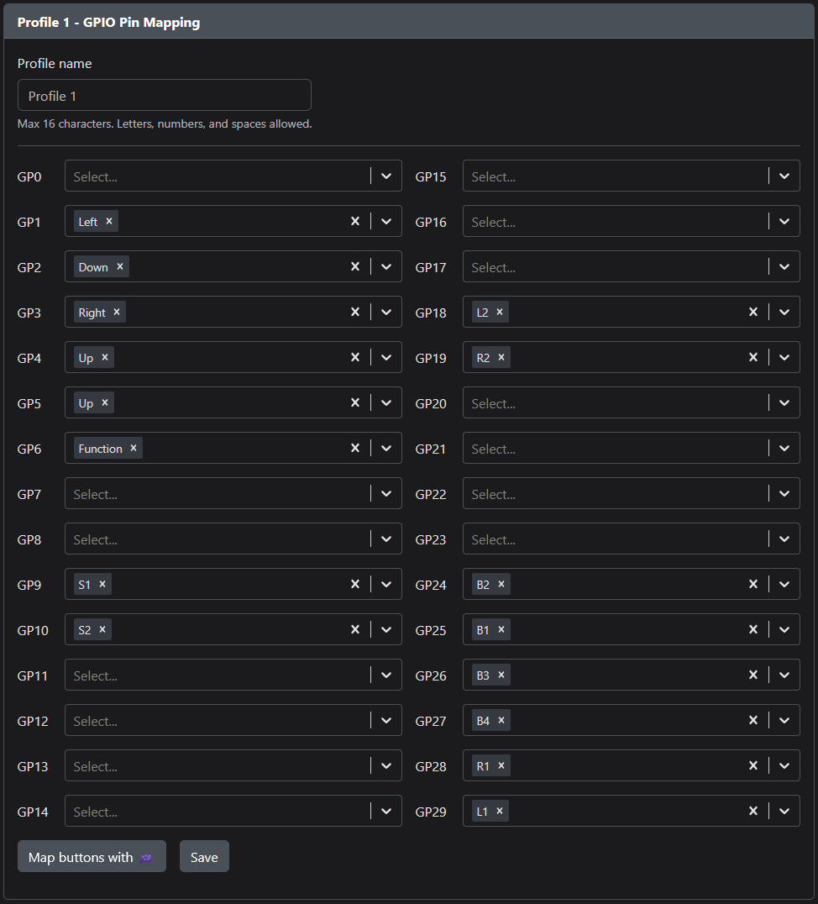

# nanosplit

Leverless (Hitbox-style) fighting game controller with a split-hand design using Cherry MX Ultra Low Profile (ULP) switches.

`TODO: One or more images`

## About

`TODO`

Powering this device is OpenStick's excellent [GP2040-CE](https://github.com/OpenStickCommunity/GP2040-CE) gamepad firmware. Please see that repository for information about configuration, console compatibility, and all the rest.

## Creation

If you want to produce one, you will need some parts.

### PCB

- 1x nanosplit PCB, created using the files in the `prod/pcb/` directory with an online PCB prototyping service. (e.g., [JLCPCB](https://jlcpcb.com/).) Productions requires assembly with SMD parts, so you'll need to include the Gerbers, BOM, and CPL files.
- 16x Cherry MX Ultra Low Profile Switches. (I used Tactile, but you could use Clicky if you want)

### Keycaps

- 16x [MPress Nano Caps](https://paradisearcadeshop.com/collections/mpress-nano) from Paradise Arcade Shop

### Case

`TODO`

- OPTIONAL: Non-slip Feet or Pads.

### Assembly

`TODO`

- Soldering Equipment.
- Screwdriver.

### Firmware

- The [Latest GP2040-CE Release](https://github.com/OpenStickCommunity/GP2040-CE/releases), flashed according to the documentation.
- Pin (Button) Mapping using GP2040-CE's [Web Configurator](https://gp2040-ce.info/#/web-configurator)
  - There is a catch: the firmware assumes a default pin mapping that the nanosplit does not use. Until you've remapped the pins, you must hold down `FIXME: Button wired to pin 1` instead of S2 (Start) when plugging in the controller to enter the configurator.
  - You could also short pin 1 to ground manually if you haven't installed the switches yet when setting up the firmware.
  - The correct mapping for the nanosplit is shown below.

### Art

`TODO`

## License

PCB and case designs licensed under [CC BY-SA 4.0](https://creativecommons.org/licenses/by/4.0/).

## Acknowledgments

- [GrooveBob](https://github.com/GroooveBob)'s [Stress](https://github.com/GroooveBob/Stress), which helped inspire this design.
- [jfedor2](https://github.com/jfedor2)'s [Flatbox](https://github.com/jfedor2/flatbox), whose RP2040 implementation I reused. [CC BY-SA 4.0](https://creativecommons.org/licenses/by/4.0/)
- [ruiqimao](https://github.com/ruiqimao)'s [Keyboard PCB Guide](https://github.com/ruiqimao/keyboard-pcb-guide), which led me through the entire PCB creation process.
- [pashutk](https://github.com/pashutk)'s [Cherry_MX_ULP](https://github.com/pashutk/Cherry_MX_ULP) repository and links, whose footprints are present in the PCB design and whose README gave me the confidence to try hand-soldering these normally-SMD switches.
- [Sadek Baroudi](https://github.com/sadekbaroudi)'s [Keyboard Case Design](https://kbd.news/Keyboard-Case-Design-1764.html) article, which showed the process for exporting the PCB into a form usable during case design.
- [OpenStickCommunity](https://github.com/OpenStickCommunity)'s [GP2040-CE](https://github.com/OpenStickCommunity/GP2040-CE), whose firmware makes the silicon useful and whose Discord community was extremely helpful.
