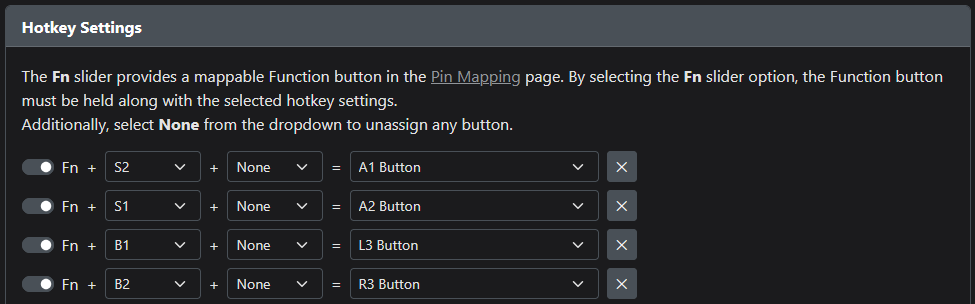

# nanosplit

Leverless (Hitbox-style) fighting game controller with a split-hand design using Cherry MX Ultra Low Profile (ULP) switches.

`TODO: One or more images`

## About

This controller was inspired by Paradise Arcade's [MPress Nano](https://paradisearcadeshop.com/products/mpress-nano-leverless-gaming-controller). I tried it at an event booth and really liked the buttons, but personally have a strong preference for split layouts.

I designed this from scratch to satisfy that desire.

Fully assembled, dimensions are `304 x 124 x 9.8mm` (including bolts and non-slip pads, `8.6mm` without).

Powering this device is OpenStick's excellent [GP2040-CE](https://github.com/OpenStickCommunity/GP2040-CE) gamepad firmware. Please see that repository for information about configuration, console compatibility, and all the rest.

## Creation

If you want to produce one, you will need some parts.

### PCB

- 1x nanosplit PCB, created using the files in the `prod/pcb/` directory with an online PCB prototyping service. (e.g., [JLCPCB](https://jlcpcb.com/).) Productions requires assembly with SMD parts, so you'll need to include the Gerbers, BOM, and CPL files.
  - If you are unfamiliar with this process, I recommend following the PCB ordering steps from [this README](https://github.com/AlpenmeisterCustoms/MeisterboxS).
- 16x Cherry MX Ultra Low Profile Switches. (I used Tactile, but you could use Clicky if you want.)
  - I purchased mine [from this German parts supplier](https://www.reichelt.com/us/en/shop/product/cherry_mx_ultra_low_profile_rgb_pushbutton_module-335042?q=%2Fapi%2Fuser%2FcountrySelect%2Fen%2Fhttps%3A%2F%2Fwww.reichelt.com%2Fde%2Fen%2Fshop%2Fproduct%2Fcherry_mx_ultra_low_profile_rgb_pushbutton_module-335042), though they don't seem to be available at that URL anymore.

### Keycaps

- 16x [MPress Nano Caps](https://paradisearcadeshop.com/collections/mpress-nano) from Paradise Arcade Shop.

### Case

- 1x [3d-Printed Case](./prod/case/nochamfer.stl)
  - I don't personally own a 3d printer, but mine came out pretty nicely using [Craftcloud](https://craftcloud3d.com/) in ABS plastic at 60% infil (though in retrospect I may have chosen 80%).
- 1x each [Acrylic "Washer" Layer](./prod/case/acrylic_layer0_1mm.dxf) and [Acrylic Bottom Panel](./prod/case/acrylic_layer1_1mm.dxf) laser cut from `1mm` acrylic.
  - I ordered these online from [Ponoko](https://www.ponoko.com/) in clear.
- OPTIONAL: Non-slip Feet or Pads.
  - I used a few pieces cut from one of [these rolls of adhesive-backed silicon](https://www.amazon.com/dp/B09VFB7QVF).
- 8x M3-0.5 3.85mm Heat-set Threaded Inserts.
  - I ordered [these exact ones](https://www.amazon.com/dp/B077CL322T).
- 8x M3x6mm Bolts.
  - I ordered [these ultra-thin flat capped bolts](https://www.amazon.com/dp/B0C5M7M6ZM).

### Assembly

- Soldering Equipment.
- M2.5 Allen Key.

### Firmware

- The Latest [GP2040-CE Firmware for the Flatbox Rev4](https://github.com/OpenStickCommunity/GP2040-CE/releases/download/v0.7.11/GP2040-CE_0.7.11_FlatboxRev4.uf2), flashed according to the documentation.
- Pin (Button) Mapping using GP2040-CE's [Web Configurator](https://gp2040-ce.info/#/web-configurator)
  - There is a catch: the firmware assumes a default pin mapping that the nanosplit does not use. Until you've remapped the pins, you must hold down `Fn` (Function) (the bottom-most button in the central line) instead of `S2` (Start) when plugging in the controller to enter the configurator.
  - You could also short those switch contacts to ground manually if you haven't installed the switches yet when setting up the firmware.
  - After updating the pin mapping in the configurator, you'll hold `S2` to while plugging the device in to reach the configurator, like normal.
  - The correct mapping for the nanosplit is shown below.

- This controller makes `A1` (Guide), `A2` (Touchpad), `L3`, and `R3` available via a layer using the `Fn` (Function) switch (the bottom-most of the central 3).
- Shown below are the recommended function mappings, though you may prefer to use your own.

### Art

`TODO: Eventually, I intend to create an art template that can be used to print artwork which will fit between the acrylic layers on the bottom of the device.`

## License

PCB and case designs licensed under [CC BY-SA 4.0](https://creativecommons.org/licenses/by/4.0/).

## Acknowledgments

- [GrooveBob](https://github.com/GroooveBob)'s [Stress](https://github.com/GroooveBob/Stress), which helped inspire this design.
- [jfedor2](https://github.com/jfedor2)'s [Flatbox](https://github.com/jfedor2/flatbox), whose RP2040 implementation I reused. [CC BY-SA 4.0](https://creativecommons.org/licenses/by/4.0/)
- [ruiqimao](https://github.com/ruiqimao)'s [Keyboard PCB Guide](https://github.com/ruiqimao/keyboard-pcb-guide), which led me through the entire PCB creation process.
- [pashutk](https://github.com/pashutk)'s [Cherry_MX_ULP](https://github.com/pashutk/Cherry_MX_ULP) repository and links, whose footprints are present in the PCB design and whose README gave me the confidence to try hand-soldering these normally-SMD switches.
- [Sadek Baroudi](https://github.com/sadekbaroudi)'s [Keyboard Case Design](https://kbd.news/Keyboard-Case-Design-1764.html) article, which showed the process for exporting the PCB into a form usable during case design.
- [OpenStickCommunity](https://github.com/OpenStickCommunity)'s [GP2040-CE](https://github.com/OpenStickCommunity/GP2040-CE), whose firmware makes the silicon useful and whose Discord community was extremely helpful.
